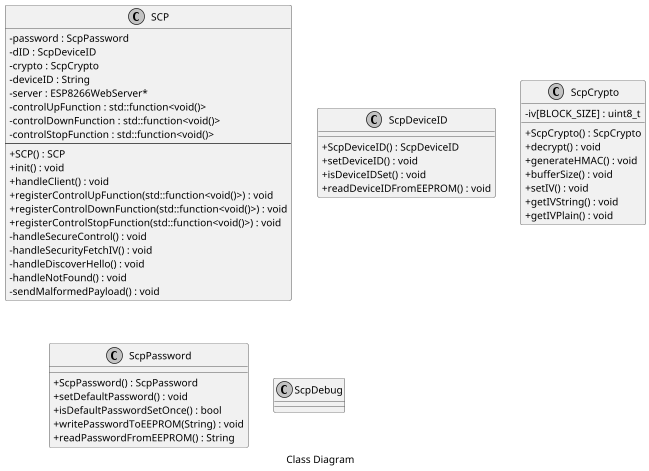

# secure-control-protocol - Work in progress

## Table of contents

- [secure-control-protocol - Work in progress](#secure-control-protocol---work-in-progress)
    - [Table of contents](#table-of-contents)
    - [Hint](#hint)
    - [1. Architecture](#1-architecture)
    - [2. Provisioning of devices](#2-provisioning-of-devices)
    - [3. Discovery of devices](#3-discovery-of-devices)
    - [4. Security](#4-security)
    - [5. HTTP Ressources](#5-http-ressources)
    - [6. REST Message Types](#6-rest-message-types)
        - [6.1 Discover message types](#61-discover-message-types)
            - [6.1.1 discover-hello](#611-discover-hello)
                - [Variables](#variables)
        - [6.2 Control messages](#62-control-messages)
            - [6.2.1 control-up](#621-control-up)
            - [6.2.2 control-down](#622-control-down)
            - [6.2.3 control-stop](#623-control-stop)
            - [6.2.4 control-status](#624-control-status)
        - [6.3 Security messages](#63-security-messages)
            - [6.3.1 security-fetch-iv](#631-security-fetch-iv)
            - [6.3.2 security-pw-change](#632-security-pw-change)
            - [6.3.3 security-wifi-config](#633-security-wifi-config)
            - [6.3.4 security-reset-to-default](#634-security-reset-to-default)
            - [6.3.5 security-restart](#635-security-restart)
    - [7. SCP Stack Software Architecture](#7-scp-stack-software-architecture)
        - [7.1 Class Diagrams](#71-class-diagrams)
    - [8. Annex](#8-annex)
        - [8.1 Default credentials](#81-default-credentials)
            - [8.1.1 Default device password](#811-default-device-password)
            - [8.1.2 Default Wifi Access Point credentials](#812-default-wifi-access-point-credentials)
    - [Project Philosophy](#project-philosophy)
    - [License](#license)
    - [Copyright](#copyright)

## Hint
A PDF version of this README with all images is stored in the `./doc/` directory.

## 1. Architecture

```puml

caption System Component Diagram

skinparam monochrome true
skinparam componentStyle uml2

scale max 650 width

package "Client Device" {
    component client [
        <<component>>
        SCP client
    ]

    artifact storage [
        <<component>>
        Storage
    ]

    component gui[
        <<component>>
        GUI
    ]
}

package "Embedded Device" {
    component server [
        <<component>>
        SCP Server
    ]

    component app [
        <<component>>
        Application Logic
    ]
}


() "/secure-control" as epSc

() "/secure-control-discover-hello" as epScDh

() "/secure-control-security-fetch-iv" as epScSfi


server -- epSc
server -- epScDh
server -- epScSfi

client --> epSc : use
client --> epScDh : use
client --> epScSfi : use

app ..> server : <<library>>

gui ..> client : <<library>>

client ..> storage : Store passwords 

```

## 2. Provisioning of devices

When the default password of the shutter-controller is set or no wifi credentials are provisioned the shutter-controller provides a Wifi Access Point using WPA2-PSK which can be accessed with the credentials defined in the annex.

When the Wifi Access Point is available the control device connects to the wifi and the shutter-controller acts as a DHCP server and provides an IP address from a small Class C IP subnet.

Now the control device can start the discovery of shutter-controller in the IP subnet. If the shutter-controller is found a new shutter-control password must be set. This can be done via the [security-pw-change message](#632-security-pw-change). As a second step the credentials of the home network wifi the shutter-controller operates in should be supplied. The user sends a the [security-wifi-config message](#633-security-wifi-config) containing the encrypted credentials to the shutter-controller. 

If a shutter-controller receives a valid [security-wifi-config message](#633-security-wifi-config) it tries to connect to the wifi and reponds with the result.

The third step is triggered by the [security-reset message](#635-security-restart) which restarts the shutter-controller and thus applies the configured settings. If the shutter-controler default password and the wifi credentials are changed / provisined, the shutter-controller is started as in the wifi client only mode.

*__Note:__* If the connection to the supplied home network wifi fails, the shutter-controller acts as a wifi access point in order to receive the new home network credentials. But in contrast to the beginning of this chapter the password for this wifi will now be the provisioned shutter-controller password.

```puml

caption Provisioning Sequence Diagram

skinparam monochrome true

scale max 650 width

Actor ":User" as user
participant ":SCP Client" as client
participant ":SCP Server " as server
note right of server
    default password set,
    no wifi access available
end note

server -> server : Start Access Point
note right of server
    SSID:
    scp-controller-<mac address>
    Password:
    1234567890123456    
end note

client -> server : Connect to wifi

server --> client : Assign IP address

client -> server : Get device information from /secure-control-discover-hello

server --> client : Send discover-response

client -> server : Get IV from /secure-control-security-fetch-iv

server -> server : Generate new IV

server --> client : Respond with IV

client -> client : Generate new password for device

client -> server : Send security-pw-change to /secure-control

server --> client : Respond with result

user -> client : Enter WiFi credentials

client -> server : Get IV from /secure-control-security-fetch-iv

server -> server : Generate new IV

server --> client : Respond with IV

client -> server : Send security-wifi-config to /secure-control containing Wifi credentials

server -> server : Try to connect to WiFi

server --> client : Respond with result

user -> client : Trigger device restart

client -> server : Get IV from /secure-control-security-fetch-iv

server -> server : Generate new IV

server --> client : Respond with IV

client -> server : Send security-restart

server -> server : Restart, applying new configuration

note right of server
    Connects as WiFi client 
    to configured WiFi network,
    Access Point is disabled
end note

```


## 3. Discovery of devices

The Android app is capable of discovering devices in a configurable network range.

To do this the app  connects to the secure-control-discover-hello ressource of each IP addresses of the configured IP address range.

The app stores the IP addresses of all devices which respond with a HTTP response 200 OK with information in the body.

```puml

caption Discover Sequence Diagram

skinparam monochrome true

scale max 650 width

participant ":SCP Server 1" as server1
participant ":SCP Server 2" as server2
participant ":Generic HTTP Server" as webserver
participant ":Device w/o webserver" as device
participant ":SCP Client" as client

client -> client : Get WiFi IP address & subnet mask
client -> client : Get network address

client -> server1 : Connect to /secure-control-discover-hello ressource
server1 --> client : Respond with HTTP 200 OK containing discover-response 

client -> device : Connect to /secure-control-discover-hello ressource
device --> client : Connection refused

client -> server2 : Connect to /secure-control-discover-hello ressource
server2 --> client : Respond with HTTP 200 OK containing discover-response 

client -> webserver : Connect to /secure-control-discover-hello ressource
webserver --> client : Respond with HTTP 404 Not found
```

## 4. Security

The security is based on pre-shared secrets.

Each SCP server has a preconfigured password which has to be changed when the first connection is established.

The SCP server does not accept control messages if the configured password matches the preconfigured one.

Additionally the password has the be 16 characters long.

The messages are encrypted using AES-128-CBC with the shared secret and an IV which has to be fetched from the device before encypting the message.

Nounce? 

Currently not covered:
- Hardware attacks (Read flash to get password)


## 5. HTTP Ressources

The device exposes the following HTTP ressources:
```
http://device-ip/secure-control
```
```
http://device-ip/secure-control/discover-hello
```
```
http://device-ip/secure-control/security-fetch-iv
```
## 6. REST Message Types

The devices waits for HTTP-GET messages with the Content-Type application/x-www-form-urlencoded.

Except for the discover messages all payloads are encrypted with the configured password for the device using AES-128-CBC with PKCS5 Padding.

The initialization vector (henceforth IV) used for the encryption is being generated on start-up by the device.
It is being fetched from the client by using the security-fetch-iv message before sending the first message and incremented by the device afterwards.
By this replay attacks are being avoided.

For all encrypted messages the following HTTP ressource is used:
```
http://device-ip/secure-control
```

The data that shall be send to the device is send in the payload parameter.
```
http://device-ip/secure-control?payload=payload
```


The payload consists of the base64 and afterwards urlencoded encrypted message.
```
payload = urlencode(base64(encrypted message))
```
The encrypted message consists of the device ID of the targeted device and the type of the message. The device ID and the type are being concetenated seperated by a colon and encrypted using AES-128-CBC afterwards using the IV and the password of the target device.
```
encrypted message = AES-128-CBC(deviceID + ":" + message type, password))
```

All messages except for the discover-hello message, respond with a HTTP 200 OK message containing a JSON object with the encrypted payload:

| Key     | Possible values   |
| ------- | ----------------- |
| payload | encrypted-payload |
```
{
    "payload" : "encrypted-payload"
}
``` 


```puml

caption Message Processing Sequence Diagram

skinparam monochrome true

scale 650 width

participant ":SCP client" as client
participant ":SCP server" as server

client -> server : Get IV from /secure-control-security-fetch-iv

server -> server : Generate new IV

server --> client : Respond with IV

client -> client : Encrypt message

client -> client : Base64 encode message

client -> client : Urlencode message

client -> server : Send message to /secure-control ressource

server -> server : Urldecode message

server -> server : Base64 decode message

server -> server : Decrypt message

server -> server : Execute command

server --> client : Send response

```


### 6.1 Discover message types

#### 6.1.1 discover-hello
```
Ressource: http://device-ip/secure-control/discover-hello?payload=payload
```
payload: discover-hello

The discover-hello message is sent to all IP addresses of the subnet to determine wether the device is a shutter-control device, it is the only message being sent without encryption. If the device is a shutter-control device it responds with a HTTP 200 OK message containing a JSON representation of the following information.

##### Variables

| Key                     | Possible values                    |
| ----------------------- | ---------------------------------- |
| type                    | discover-response                  |
| device-id               | device id (16 byte)                |
| device-type             | shutter-control                    |
| current password number | number of password changes         |
| hmac                    | Keyed-Hashed Massage Authentication Code |
```
{
    "type" : "discover-response",
    "deviceId" : "device ID",
    "deviceType" : "shutter-control",
    "currentPasswordNumber" : number of password changes   ,
    "hmac" : Keyed-Hashed Massage Authentication Code
}
```
### 6.2 Control messages

#### 6.2.1 control-up

The control-up message tells the shutters to open, but only if the password has been changed.

Additionally the deviceID provided in the payload must match the configured device ID.

decrypted payload: deviceID:control-up

The encrypted payload of the response consists of a JSON representation of the following data:

| Key      | Possible values     |
| -------- | ------------------- |
| type     | control-up          |
| deviceId | device ID           |
| status   | neutral / up / error |
```
{
    "type" : "control-up",
    "deviceId" : "device ID",
    "status" : neutral / up / error
}
```
#### 6.2.2 control-down

The control-down message tells the shutters to close, but only if the password has been changed.

Additionally the deviceID provided in the payload must match the configured device ID.

decrypted payload: deviceID:control-down

The encrypted payload of the response consists of a JSON representation of the following data:

| Key      | Possible values        |
| -------- | ---------------------- |
| type     | control-down           |
| deviceId | device ID              |
| status   | neutral / down / error |
```
{
    "type" : "control-down",
    "deviceId" : "device ID",
    "status" : neutral / down / error
}
```

#### 6.2.3 control-stop

The control-stop message tells the shutters to stop, but only if the password has been changed.

Additionally the deviceID provided in the payload must match the configured device ID.

decrypted payload: deviceID:control-stop

The encrypted payload of the response consists of a JSON representation of the following data:

| Key      | Possible values       |
| -------- | --------------------- |
| type     | control-stop          |
| deviceId | device ID             |
| status   | neutral / stop / error |
```
{
    "type" : "control-stop",
    "deviceId" : "device ID",
    "status" : neutral / stop / error
}
```

#### 6.2.4 control-status

The control-status message return the current status of the shutters to the client, but only if the password has been changed.

Additionally the deviceID provided in the payload must match the configured device ID.

decrypted payload: deviceID:control-status

The encrypted payload of the response consists of a JSON representation of the following data:

| Key      | Possible values         |
| -------- | ----------------------- |
| type     | control-status          |
| deviceId | device ID               |
| status   | neutral / status / error |
```
{
    "type" : "control-status",
    "deviceId" : "device ID",
    "status" : neutral / status / error
}
```

### 6.3 Security messages

#### 6.3.1 security-fetch-iv

The security-fetch-iv message fetches the initialization vector from the device. The message and response are not encrypted as the IV has not to be secret.

Additionally the deviceID provided in the payload must match the configured device ID.
```
Ressource: http://device-ip/secure-control/security-fetch-iv
```
payload = deviceID

The payload of the response consists of a JSON representation of the following data:

| Key  | Possible values             |
| ---- | --------------------------- |
| type | security-fetch-iv        |
| iv   | Stored initilization vector |
```
{
    "type" : "security-fetch-iv",
    "deviceId" : "device ID",
    "iv" : Stored initilization vector
}
```

#### 6.3.2 security-pw-change

The security-pw-change message tells the device to change it's old password to the new one.

Additionally the deviceID provided in the payload must match the configured device ID.

decrypted payload = deviceID:security-pw-change:new password

Hint:
The old password does not has to be send because it is used by the device for the encryption of the message.

The encrypted payload of the response consists of a JSON representation of the following data:

| Key    | Possible values    |
| ------ | ------------------ |
| type   | security-pw-change |
| result | done / error       |
```
{
    "type" : "security-pw-change",
    "result" : done / error
}
```

#### 6.3.3 security-wifi-config

The security-wifi-change message tells the device to set the Wifi client credentials it should use to access the target network.

Additionally the deviceID provided in the payload must match the configured device ID.

decrypted payload = deviceID:security-wifi-config:ssid:pre-shared-key

The encrypted payload of the response consists of a JSON representation of the following data:

| Key    | Possible values              |
| ------ | ---------------------------- |
| type   | security-wifi-config         |
| result | successfull / failed / error |
```
{
    "type" : "security-wifi-config",
    "result" : successfull / failed / error
}
```

#### 6.3.4 security-reset-to-default

The security-reset-to-default message tells the device to reset all persistent changes 
to the factory default settings, e.g. the password.

decrypted payload = deviceID:security-reset-to-default

The encrypted payload of the response consists of a JSON representation of the following data:

| Key    | Possible values           |
| ------ | ------------------------- |
| type   | security-reset-to-default |
| result | done / error     |
```
{
    "type" : "security-reset-to-default",
    "result" : done / error
}
```

#### 6.3.5 security-restart

The security-restart message tells the device to apply a new configuration by restarting.

decrypted payload = deviceID:security-restart

The encrypted payload of the response consists of a JSON representation of the following data:

| Key    | Possible values       |
| ------ | --------------------- |
| type   | security-restart      |
| result | done / error |
```
{
    "type" : "security-restart",
    "result" : done / error
}
```

## 7. SCP Stack Software Architecture

### 7.1 Class Diagrams



## 8. Annex

### 8.1 Default credentials

#### 8.1.1 Default device password
The default device password is 124567890123456.

#### 8.1.2 Default Wifi Access Point credentials
SSID: "scp-controller-" + MAC Address

Pre-Shared-Key: default device password


## Project Philosophy

## License
SPDX-License-Identifier: GPL-3.0-or-later

The full version of the license can be found in LICENSE.

If you need a license for commercial use, please contact [Benjamin Schilling](mailto:schilling.benjamin@delusionsoftware.de).

## Copyright
Copyright (C) 2018 Benjamin Schilling
