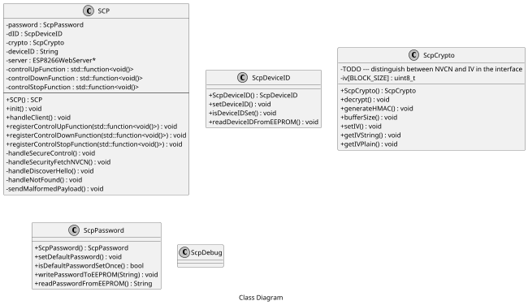

# secure-control-protocol - Work in progress

## Table of contents

- [secure-control-protocol - Work in progress](#secure-control-protocol---work-in-progress)
  - [Table of contents](#table-of-contents)
  - [Hint](#hint)
  - [0. About](#0-about)
    - [0.1 Purpose](#01-purpose)
    - [0.2 Goal](#02-goal)
  - [1. Architecture](#1-architecture)
  - [2. Provisioning of devices](#2-provisioning-of-devices)
  - [3. Discovery of devices](#3-discovery-of-devices)
  - [4. Security](#4-security)
  - [5. HTTP Ressources](#5-http-ressources)
  - [6. REST Message Types](#6-rest-message-types)
    - [6.1 Discover message types](#61-discover-message-types)
      - [6.1.1 discover-hello](#611-discover-hello)
        - [Variables](#variables)
    - [6.2 Control messages](#62-control-messages)
      - [6.2.1 control-up](#621-control-up)
      - [6.2.2 control-down](#622-control-down)
      - [6.2.3 control-stop](#623-control-stop)
      - [6.2.4 control-status](#624-control-status)
    - [6.3 Security messages](#63-security-messages)
      - [6.3.1 security-fetch-nvcn](#631-security-fetch-nvcn)
      - [6.3.2 security-pw-change](#632-security-pw-change)
      - [6.3.3 security-wifi-config](#633-security-wifi-config)
      - [6.3.4 security-reset-to-default](#634-security-reset-to-default)
      - [6.3.5 security-restart](#635-security-restart)
  - [7. SCP Stack Software Architecture](#7-scp-stack-software-architecture)
    - [7.1 Used Libraries](#71-used-libraries)
    - [7.2 Class Diagrams](#72-class-diagrams)
  - [8. Annex](#8-annex)
    - [8.1 Default credentials](#81-default-credentials)
      - [8.1.1 Default device password](#811-default-device-password)
      - [8.1.2 Default Wifi Access Point credentials](#812-default-wifi-access-point-credentials)
    - [8.2 ESP8266 EEPROM Layout](#82-esp8266-eeprom-layout)
  - [Project Philosophy](#project-philosophy)
  - [License](#license)
  - [Copyright](#copyright)

## Hint
A PDF version of this README with all images is stored in the `./doc/` directory.

## 0. About

### 0.1 Purpose

The purpose of the Secure Control Protocol is to enable makers to develop home automation devices based on the ESP8266 with minimum effort while providing a substantial level of security compared to other solutions. 

### 0.2 Goal

The goal is to provide a ready to use protocol and server where the user only has to register his own functions without a special need for configuration of the server.

## 1. Architecture

```puml

caption System Component Diagram

skinparam monochrome true
skinparam componentStyle uml2

scale max 650 width

package "Client Device" {
    component client [
        <<component>>
        SCP client
    ]

    artifact storage [
        <<component>>
        Storage
    ]

    component gui[
        <<component>>
        GUI
    ]
}

package "Embedded Device" {
    component server [
        <<component>>
        SCP Server
    ]

    component app [
        <<component>>
        Application Logic
    ]
}


() "/secure-control" as epSc

() "/secure-control-discover-hello" as epScDh

() "/secure-control-security-fetch-NVCN" as epScSfi


server -- epSc
server -- epScDh
server -- epScSfi

client --> epSc : use
client --> epScDh : use
client --> epScSfi : use

app ..> server : <<library>>

gui ..> client : <<library>>

client ..> storage : Store passwords 

```

## 2. Provisioning of devices

When the default password of the secure-controller is set or no wifi credentials are provisioned the secure-controller provides a Wifi Access Point using WPA2-PSK which can be accessed with the [default credentials from the annex](#81-default-credentials).

When the Wifi Access Point is available the control device connects to the wifi and the secure-controller acts as a DHCP server and provides an IP address from a small Class C IP subnet.

Now the control device can start the discovery of secure-controller in the IP subnet. If the secure-controller is found a new secure-control password must be set. This can be done via the [security-pw-change message](#632-security-pw-change). As a second step the credentials of the home network wifi the secure-controller operates in should be supplied. The user sends a the [security-wifi-config message](#633-security-wifi-config) containing the encrypted credentials to the secure-controller. 

If a secure-controller receives a valid [security-wifi-config message](#633-security-wifi-config) it tries to connect to the wifi and reponds with the result.

The third step is triggered by the [security-reset message](#635-security-restart) which restarts the secure-controller and thus applies the configured settings. If the secure-controller default password and the wifi credentials are changed / provisined, the secure-controller is started as in the wifi client only mode.

*__Note:__* If the connection to the supplied home network wifi fails, the secure-controller acts as a wifi access point in order to receive the new home network credentials. But in contrast to the beginning of this chapter the password for this wifi will now be the provisioned secure-controller password.

```puml

caption Provisioning Sequence Diagram

skinparam monochrome true

scale max 650 width

Actor ":User" as user
participant ":SCP Client" as client
participant ":SCP Server " as server
note right of server
    default password set,
    no wifi access available
end note

server -> server : Start Access Point
note right of server
    SSID:
    scp-controller-<mac address>
    Password:
    1234567890123456    
end note

client -> server : Connect to wifi

server --> client : Assign IP address

client -> server : Get device information from /secure-control-discover-hello

server --> client : Send discover-response

client -> server : Get NVCN from /secure-control-security-fetch-NVCN

server -> server : Generate new NVCN

server --> client : Respond with NVCN

client -> client : Generate new password for device

client -> server : Send security-pw-change to /secure-control

server --> client : Respond with result

user -> client : Enter WiFi credentials

client -> server : Get NVCN from /secure-control-security-fetch-NVCN

server -> server : Generate new NVCN

server --> client : Respond with NVCN

client -> server : Send security-wifi-config to /secure-control containing Wifi credentials

server -> server : Try to connect to WiFi

server --> client : Respond with result

user -> client : Trigger device restart

client -> server : Get NVCN from /secure-control-security-fetch-NVCN

server -> server : Generate new NVCN

server --> client : Respond with NVCN

client -> server : Send security-restart

server -> server : Restart, applying new configuration

note right of server
    Connects as WiFi client 
    to configured WiFi network,
    Access Point is disabled
end note

```


## 3. Discovery of devices

The Android app acts as a control device and is capable of discovering devices in the local subnet network range.

To do this the app connects to the secure-control-discover-hello ressource of each IP addresses of the configured IP address range.

The app stores the IP addresses of all devices which respond with a HTTP response 200 OK with information in the body.

```puml

caption Discover Sequence Diagram

skinparam monochrome true

scale max 650 width

participant ":SCP Server 1" as server1
participant ":SCP Server 2" as server2
participant ":Generic HTTP Server" as webserver
participant ":Device w/o webserver" as device
participant ":SCP Client" as client

client -> client : Get WiFi IP address & subnet mask
client -> client : Get network address

client -> server1 : Connect to /secure-control-discover-hello ressource
server1 --> client : Respond with HTTP 200 OK containing discover-response 

client -> device : Connect to /secure-control-discover-hello ressource
device --> client : Connection refused

client -> server2 : Connect to /secure-control-discover-hello ressource
server2 --> client : Respond with HTTP 200 OK containing discover-response 

client -> webserver : Connect to /secure-control-discover-hello ressource
webserver --> client : Respond with HTTP 404 Not found
```

## 4. Security

The security is based on pre-shared secrets. Each device has its own secret. The secret is only shared between the secure-controller and the control device(s).

Each secure-controller has a preconfigured password which has to be changed when the secure-controller is first accessed. The secure-controller does __not__ accept any [control messages](#62-control-messages) or [security messages](#63-security-messages) (besides the [security-pw-change message](#632-security-pw-change)) if the current secure-controller password matches the [default password from the annex](#811-default-device-password).

The password has the be 16 characters long. This ensures a adequate security due to the large key space. The password will usually not be used by a human user. The secret is set by the controller device and sored in the secure-controller. Therefore the length limitation does not pose a usability problem.   

All (except for [6.1.1 discover-hello](#611-discover-hello)) exchanged messages are encrypted. The method used is AES-128-CBC with the shared password, a NVCN and an initialization vector (IV).

To prevent attacks on the content / password of the exchanged messages an additional measure is taken. For every message an intitialzation vector is generated (a 128 bit random number). This number is generated by the sender of the message. It is added at the beginning of the message contents. 

The NVCN shall prevent replay attacks and needs to be fetched from the secure-controller by the control device for every single message before encrypting it. The correctness of the supplied NVCN of each message is checked by the secure-controller.

*__Currently not covered:__*

No hardware attacks are currently considered. The flash memory of the secure-controller stores the secure-controller password which could be read and missused. This attack is considered to be unlikely and of limited use only since every device has a seperate password. Never the less any ideas / comments on this issue are very welcome. 


## 5. HTTP Ressources

The device exposes the following HTTP ressources:

```
http://device-ip/secure-control
```
```
http://device-ip/secure-control/discover-hello
```
```
http://device-ip/secure-control/security-fetch-NVCN
```

## 6. REST Message Types

The secure-controller waits for HTTP-GET messages with the Content-Type application/x-www-form-urlencoded.

Almost all messages are encrypted, see [security chapter](#4-security) for details on the algorithms and exceptions.

The initialization vector (NVCN) used for replay protection is randomly generated on secure-controller start-up. It is being fetched from the control device by using the security-fetch-NVCN message before sending a message to the secure-controller. The NVCN is incremented by the secure-controller after every [security-fetch-NVCN message](#631-security-fetch-NVCN).

For all encrypted messages the following HTTP ressource is used:
```
http://device-ip/secure-control
```

The data send to the secure-controller is encoded in the payload parameter.
```
http://device-ip/secure-control?payload=encoded_data
```

The encoded_data consists of the base64 and urlencoded encrypted message.
```
encoded_data = urlencode(base64(encrypted_message))
```
The encrypted_message consists of a IV, the device ID of the secure-controller, the NVCN and the type of the message. The NVCN, the device ID and the type are being concetenated. As seperator a colon is used. The message is then encrypted using the IV and the secure-controller password.
```
encrypted_message = IV + encrypt(NVCN + ":" + deviceID + ":" + message_type, IV, password)
```

All messages except for the discover-hello message, respond with a HTTP 200 OK message containing a JSON object with the encrypted payload:

| Key     | Possible values   |
|---------|-------------------|
| payload | encrypted-payload |
```
{
    "payload" : "encrypted-payload"
}
``` 


```puml

caption Message Processing Sequence Diagram

skinparam monochrome true

scale 650 width

participant ":SCP client" as client
participant ":SCP server" as server

client -> server : Get NVCN from /secure-control-security-fetch-NVCN

server -> server : Generate new NVCN

server --> client : Respond with NVCN

client -> client : Encrypt message

client -> client : Base64 encode message

client -> client : Urlencode message

client -> server : Send message to /secure-control ressource

server -> server : Urldecode message

server -> server : Base64 decode message

server -> server : Decrypt message

server -> server : Execute command

server --> client : Send response

```


### 6.1 Discover message types

#### 6.1.1 discover-hello
```
Ressource: http://device-ip/secure-control/discover-hello?payload=discover-hello
```

The discover-hello message is sent to all IP addresses of the home network subnet to determine which IP addresses beloang to a secure-controller. It is the only message being sent without encryption. If the device is a secure-controller it responds with a HTTP 200 OK message containing a JSON representation of the following information.

The HMAC is calculated as follows:
```
hmac = "discover-response" + deviceID + deviceType + IP Address + current password number
```

##### Variables

| Key                     | Possible values                          |
|-------------------------|------------------------------------------|
| type                    | discover-response                        |
| device-id               | device id (16 byte)                      |
| device-type             | device type                              |
| current password number | number of password changes, 0 is default |
| hmac                    | Keyed-Hashed Massage Authentication Code |
```
{
    "type" : "discover-response",
    "deviceId" : "device ID",
    "deviceType" : "secure-controller",
    "currentPasswordNumber" : number of password changes   ,
    "hmac" : Keyed-Hashed Massage Authentication Code
}
```
### 6.2 Control messages

#### 6.2.1 control-up

Ressource:
```
http://device-ip/secure-control?payload=encoded_data
```

The control-up message tells the secure-controller to open.

The deviceID provided in the payload must match the configured device ID.

The NVCN provided in the payload must match (current_controller_NVCN-1).

The encoded_data payload is created according to [REST message types and encoding](#6-rest-message-types) using:
message_type=control-up

The encrypted payload of the response consists of a JSON representation of the following data:

| Key      | Possible values      |
|----------|----------------------|
| type     | control-up           |
| deviceId | device ID            |
| status   | neutral / up / error |
```
{
    "type" : "control-up",
    "deviceId" : "device ID",
    "status" : "neutral" | "up" | "error"
}
```
The status vaules have the following meaning:

| status    | description                                   |
|-----------|-----------------------------------------------|
| "neutral" | the power to the motor is not connected       |
| "up"      | the motor is turning towards upmost postition |
| "error"   | some error occured                            |

#### 6.2.2 control-down

The control-down message tells the secure-controller to close.

The deviceID provided in the payload must match the configured device ID.

The NVCN provided in the payload must match (current_controller_NVCN-1).

The encoded_data payload is created according to [REST message types and encoding](#6-rest-message-types) using:
message_type=control-down

The encrypted payload of the response consists of a JSON representation of the following data:

| Key      | Possible values        |
|----------|------------------------|
| type     | control-down           |
| deviceId | device ID              |
| status   | neutral / down / error |
```
{
    "type" : "control-down",
    "deviceId" : "device ID",
    "status" : "neutral" | "down" | "error"
}
```
The status vaules have the following meaning:

| status    | description                                     |
|-----------|-------------------------------------------------|
| "neutral" | the power to the motor is not connected         |
| "down"    | the motor is turning towards downmost postition |
| "error"   | some error occured                              | 


#### 6.2.3 control-stop

Ressource:
```
http://device-ip/secure-control?payload=encoded_data
```

The control-stop message tells the secure-controller to stop.

The deviceID provided in the payload must match the configured device ID.

The NVCN provided in the payload must match (current_controller_NVCN-1).

The encoded_data payload is created according to [REST message types and encoding](#6-rest-message-types) using:
message_type=control-stop

The encrypted payload of the response consists of a JSON representation of the following data:

| Key      | Possible values        |
|----------|------------------------|
| type     | control-stop           |
| deviceId | device ID              |
| status   | neutral / stop / error |
```
{
    "type" : "control-stop",
    "deviceId" : "device ID",
    "status" : "neutral" | "stop" | "error"
}
```
The status vaules have the following meaning:

| status  | description                             |
|---------|-----------------------------------------|
| "stop"  | the power to the motor is not connected |
| "error" | some error occured                      |

#### 6.2.4 control-status

Ressource:
```
http://device-ip/secure-control?payload=encoded_data
```

The control-status message returns the current status of the secure-controller to the control device.

The deviceID provided in the payload must match the configured device ID.

The NVCN provided in the payload must match (current_controller_NVCN-1).

The encoded_data payload is created according to [REST message types and encoding](#6-rest-message-types) using:
message_type=control-status

The encrypted payload of the response consists of a JSON representation of the following data:

| Key      | Possible values             |
|----------|-----------------------------|
| type     | control-status              |
| deviceId | device ID                   |
| status   | neutral / up / down / error |
```
{
    "type" : "control-status",
    "deviceId" : "device ID",
    "status" : "neutral" | up | down | "error"
}
```
The status vaules have the following meaning:

| status  | description                                     |
|---------|-------------------------------------------------|
| "up"    | the motor is turning towards upmost postition   |
| "down"  | the motor is turning towards downmost postition |
| "stop"  | the power to the motor is not connected         |
| "error" | some error occured                              |

### 6.3 Security messages

#### 6.3.1 security-fetch-nvcn
Ressource:
```
http://device-ip/secure-control/security-fetch-nvcn?payload=encoded_data
```

The security-fetch-nvcn message fetches the initialization vector from the device.

The deviceID provided in the payload must match the configured device ID.

The encoded_data payload is created according to [REST message types and encoding](#6-rest-message-types) using:
message_type =
encoded_data = deviceID

The unencrypted payload of the response consists of a JSON representation of the following data:

| Key  | Possible values                                 |
|------|-------------------------------------------------|
| type | security-fetch-nvcn                             |
| nvcn | current secure-controller initialization vector |
```
{
    "type" : "security-fetch-nvcn",
    "deviceId" : "device ID",
    "nvcn" : Stored initialization vector
}
```

#### 6.3.2 security-pw-change

The security-pw-change message tells the device to change it's old password to the new one.

Additionally the deviceID provided in the payload must match the configured device ID.

decrypted payload = deviceID:security-pw-change:new password

Hint:
The old password does not has to be send because it is used by the device for the encryption of the message.

The encrypted payload of the response consists of a JSON representation of the following data:

| Key    | Possible values    |
|--------|--------------------|
| type   | security-pw-change |
| result | done / error       |
```
{
    "type" : "security-pw-change",
    "result" : done / error
}
```

#### 6.3.3 security-wifi-config

The security-wifi-change message tells the device to set the Wifi client credentials it should use to access the target network.

Additionally the deviceID provided in the payload must match the configured device ID.

decrypted payload = deviceID:security-wifi-config:ssid:pre-shared-key

The encrypted payload of the response consists of a JSON representation of the following data:

| Key    | Possible values              |
|--------|------------------------------|
| type   | security-wifi-config         |
| result | successfull / failed / error |
```
{
    "type" : "security-wifi-config",
    "result" : successfull / failed / error
}
```

#### 6.3.4 security-reset-to-default

The security-reset-to-default message tells the device to reset all persistent changes 
to the factory default settings, e.g. the password.

decrypted payload = deviceID:security-reset-to-default

The encrypted payload of the response consists of a JSON representation of the following data:

| Key    | Possible values           |
|--------|---------------------------|
| type   | security-reset-to-default |
| result | done / error              |
```
{
    "type" : "security-reset-to-default",
    "result" : done / error
}
```

#### 6.3.5 security-restart

The security-restart message tells the device to apply a new configuration by restarting.

decrypted payload = deviceID:security-restart

The encrypted payload of the response consists of a JSON representation of the following data:

| Key    | Possible values  |
|--------|------------------|
| type   | security-restart |
| result | done / error     |
```
{
    "type" : "security-restart",
    "result" : done / error
}
```

## 7. SCP Stack Software Architecture

### 7.1 Used Libraries

The SCP Arduino library uses the arduino-crypto and rBase64 libraries.

The can be found in the repositories described in the library.json file.

### 7.2 Class Diagrams



## 8. Annex

### 8.1 Default credentials

#### 8.1.1 Default device password
The default device password is 124567890123456.

#### 8.1.2 Default Wifi Access Point credentials
SSID: "scp-controller-" + MAC Address

Pre-Shared-Key: default device password

### 8.2 ESP8266 EEPROM Layout
|   | 0 | 1 | 2 | 3 | 4 | 5 | 6 | 7 | 8 | 9 | 10 | 11 | 12 | 13 | 14 | 15 |
| - | - | - | - | - | - | - | - | - | - | - | -  | -  | -  | -  | -  | -  |
| 0 | res. | res. | res. | res. | res. | res. | DevID Set | Pw Set |PW | PW | PW | PW | PW | PW | PW | PW |
| 16 | PW | PW | PW | PW | PW | PW | PW | PW | DevID | DevID | DevID | DevID | DevID | DevID | DevID | DevID |
| 32 | DevID | DevID | DevID | DevID | DevID | DevID | DevID | DevID | Pw #  | Pw #  | Pw #  | Pw #  | Pw #  | Pw #  | Pw #  | Pw #  |
| 48 | Pw #  | Pw #  | Pw #  | Pw #  | Pw #  | Pw #  | Pw #  | Pw #  | Pw #  | Pw #  | Pw #  | Pw #  | Pw #  | Pw #  | Pw #  | Pw #  |
| 64 | Pw #  | Pw #  | Pw #  | Pw #  | Pw #  | Pw #  | Pw #  | Pw #  |

## Project Philosophy

To enhance the security of the project and devices using the protocol the project is licensed under the GPL Version 3.0 or later to prevent third parties from using it while lowering the level of security without disclosure.

## License
SPDX-License-Identifier: GPL-3.0-or-later

The full version of the license can be found in LICENSE.

If you need a license for commercial use, please contact [Benjamin Schilling](mailto:schilling.benjamin@delusionsoftware.de).

## Copyright
Copyright (C) 2018 Benjamin Schilling
