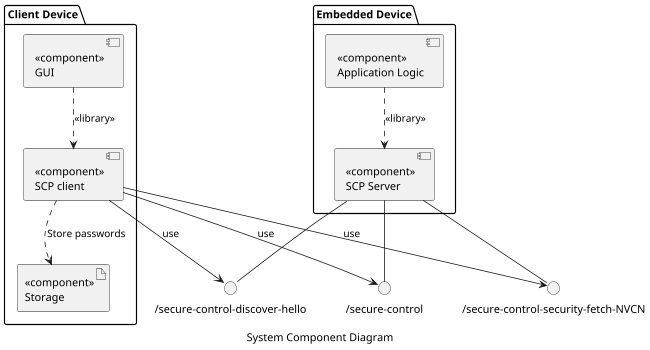
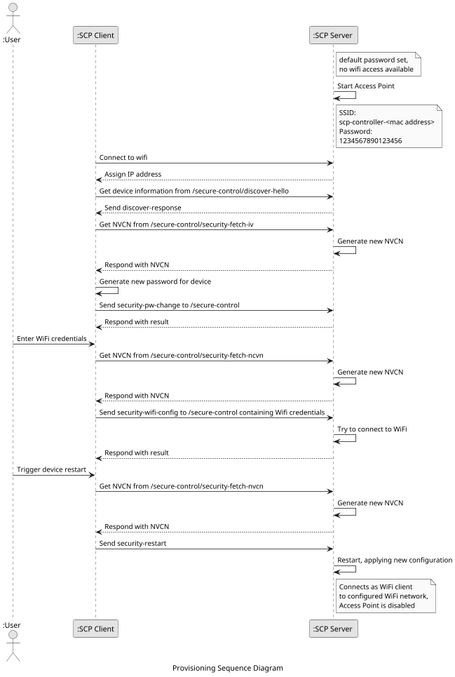
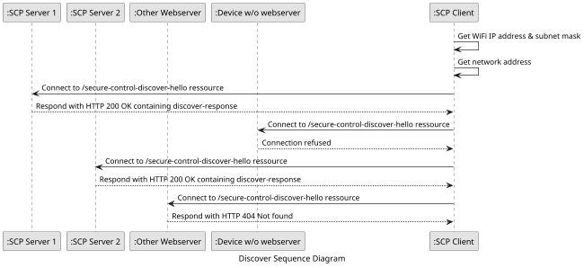
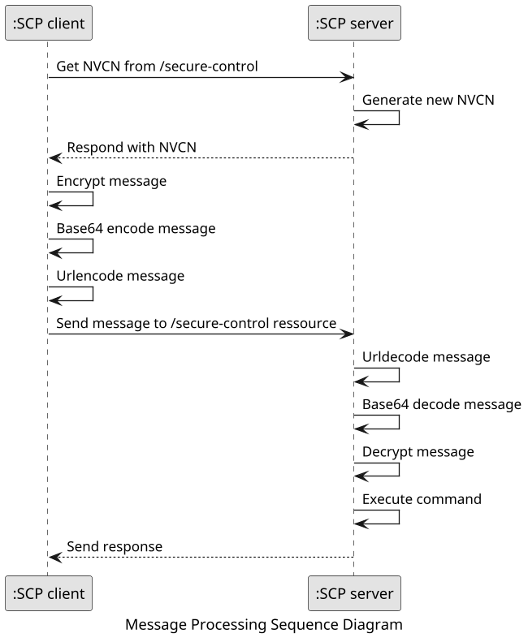

# secure-control-protocol - Work in progress

## Terms and abbreviations

The following terms and abbreviations are used in this document. 

| Term     | Description                             |
| -------- | --------------------------------------- |
| ESP8266  | Cheap Wifi Microcontroller by espressif |
| ChaCha20 | Symmetric Cryptography Cipher           |
| Poly1305 | Cryptographic MAC                       |
|          |                                         |

| Abbreviation | Description                                   |
| ------------ | --------------------------------------------- |
| SCP          | Secure Control Protocol                       |
| PSK          | Pre-shared Key                                |
| AEAD         | Authenticated Encryption with Associated Data |
| MAC          | Message Authentication Code                   |
| Nonce        | Number-used-once                              |
| HMAC         | Keyed-Hash Message Authenitcation Code        |
| NVCN         | Next valid control number                     |

## 0. About

### 0. 1 Purpose

The purpose of the Secure Control Protocol is to enable makers to develop home automation devices based on the ESP8266 with minimum effort while providing a substantial level of security compared to other solutions. 

### 0. 2 Goal

The goal is to provide a ready to use protocol and server where the user only has to register his own functions without a special need for configuration of the server. 

## 1. Architecture



The SCP webserver on the device is running on port 18215 which reflects the numbers of the letters, S (19), C (3) and P (16) in the alphabet.

## 2. Provisioning of devices

When the default password of the secure-controller is set or no Wifi credentials are provisioned the secure-controller provides a Wifi Access Point using WPA2-PSK which can be accessed with the [default credentials from the annex](#81-default-credentials). 

When the Wifi Access Point is available the client connects to the Wifi and the secure-controller acts as a DHCP server and provides an IP address from a small Class C IP subnet. 

Now the client can start the discovery of secure-controllers in the IP subnet. 
If the secure-controller is found a new password must be set. 
This is done via the [security-pw-change message](#632-security-pw-change). 
As a second step the credentials of the home network Wifi where the secure-controller operates in should be supplied. 
The user sends a the [security-wifi-config message](#633-security-wifi-config) containing the encrypted credentials to the secure-controller. 

If a secure-controller receives a valid [security-wifi-config message](#633-security-wifi-config) it tries to connect to the wifi and reponds with the result. 

The third step is triggered by the [security-restart message](#635-security-restart) which restarts the secure-controller and thus applies the configured settings. 
If the secure-controller default password and the wifi credentials are changed / provisioned, the secure-controller is started in the Wifi client only mode. 

If the connection to the supplied home network Wifi fails, the secure-controller acts as a Wifi access point in order to receive the new home network credentials. 
But in contrast to the beginning of this chapter the password for this Wifi will now be the provisioned secure-controller password. 



## 3. Discovery of devices

The SCP Client acts as a managing device and is capable of discovering devices in the local subnet network range. 

To do this the client connects to the secure-control-discover-hello ressource of each IP addresses of the configured IP address range. 

The client stores the IP addresses of all devices which respond with a HTTP response 200 OK with information in the body. 



## 4. Security

The security is based on pre-shared secrets. 
Each device has its own secret. 
The secret is only shared between the secure-controller and the client device(s). 

Each secure-controller has a preconfigured secret which has to be changed when the secure-controller is first controlled. 
The secure-controller does __not__ accept any [control messages](#62-control-messages) or [security messages](#63-security-messages) (besides the [security-pw-change message](#632-security-pw-change)) if the current secure-controller secret matches the [default password from the annex](#811-default-device-password). 

The secret has to be 32 characters long. 
The length is given by the ChaCha20 encryption algorithm. 
The secret will usually not be used by a human user since the whole provisioning is an automated process. 
The secret is set by the client device and stored in the secure-controller. 
Therefore the length limitation does not pose a usability problem. 

All (except for [6. 1. 1 discover-hello](#611-discover-hello)) messages send by control devices are encrypted. 
The method used is ChaCha20 Poly1305 with the pre-shared key, a nonce and a salt in the payload. 

`ChaCha20_Poly1305(<key>, <nonce>, <payload>) = Encrypted Message, MAC` 

Requests send by the client contain the following URL encoded data:
```json
{
    "payload": "<payload>",
    "payloadLength": "<length of payload>",
    "nonce": "<nonce>",
    "mac": "<mac>"
}
```
The playload is assembled as follows:
`payload(<salt> + ":" + "<message type>" + ":" + "<device id>" + ":" + <NVCN> + ":" + <plain text message>)` 

The **Next Valid Control Number (NVCN)** is intended to prevent replay attacks and needs to be fetched from the secure-controller by the control device for every single message before encrypting it. 
The correctness of the supplied **NVCN** of each message is checked by the secure-controller. 

The salt in the payload is used to strengthen the encryption by reducing the possibility of using the same key, nonce and payload for the encryption. The salt is discarded by the communication partner receiving it.

The discover-hello request is unencrypted. 

All responses are not encrypted but protected with a SHA512 HMAC using the device password as key.

```json
{
    "response": "<base64 encoded response payload>",
    "hmac" : "<HMAC of response>"
}
```

After checking that the returned JSON only contains the **response** and **hmac** fields and the HMAC check of the response was successful, the response may be decoded.

The resulting string depends on the request and is described in the individual chapter of the request below.

### 4. 1 Storage of Wifi Credentials on the device

To protect the Wifi credentials on the device, they are encrypted using a hardware based key derivation function. 

*__Currently not covered:__*

No hardware attacks are currently considered. 
The flash memory of the secure-controller stores the secure-controller password which could be read and missused. 
This attack is considered to be unlikely and of limited use only since every device has a separate password. 
Nevertheless any ideas / comments on this issue are very welcome. 

## 5. HTTP Ressources

The device exposes the following HTTP ressources:

``` 
http://device-ip/secure-control
```

``` 
http://device-ip/secure-control/discover-hello
```

### 5. 1 Typical message flow

The NVCN used for replay protection is randomly generated on secure-controller start-up. 
It is being fetched from the control device by using the security-fetch-NVCN message before sending a message to the secure-controller. 
The NVCN is incremented by the secure-controller after every [security-fetch-NVCN message](#631-security-fetch-NVCN). 



## 6. REST Message Types

The secure-controller waits for HTTP-GET messages with the Content-Type application/x-www-form-urlencoded. 

Almost all messages are encrypted, see [security chapter](#4-security) for details on the algorithms and exceptions. 

For all encrypted messages the following HTTP ressource is used:

``` 
http://device-ip/secure-control
```

The data send to the secure-controller is encoded in the following query parameters. 

| Key           | Possible values                 |
| ------------- | ------------------------------- |
| payload       | encrypted-payload               |
| payloadLength | length of the encrypted-payload |
| nonce         | base64 encoded Nonce            |
| mac           | base64 encoded MAC              |

Example Request String:

``` 
http://device-ip/secure-control?payload=payload&payloadLength=length&nonce=nonceValue&mac=macValue
```

The payload consists of the base64 and urlencoded encrypted message:

``` 
payload = urlencode(base64(encrypted_message))
```

The encrypted message consists of the data described in Chapter 4. 

All messages except for the discover-hello message, respond with a HTTP 200 OK message containing a JSON object with the following elements:

| Key     | Possible values      |
| ------- | -------------------- |
| payload | encrypted-payload    |
| nonce   | base64 encoded Nonce |
| mac     | base64 encoded MAC   |

```json
{
    "payload" : "encrypted-payload",
    "nonce" : "base64 encoded Nonce",
    "mac" : "base64 encoded MAC",
}
``` 

### 6.1 Discover message types

#### 6.1.1 discover-hello
```
Ressource: http://device-ip/secure-control/discover-hello?payload=discover-hello
``` 

The discover-hello message is sent to all IP addresses of the home network subnet to determine which IP addresses belongs to a secure-controller. 
It is the only message being sent without encryption. 
If the device is a secure-controller it responds with a HTTP 200 OK message containing a JSON representation of the following information.

The configured password of the device is used as the key in the HMAC calculation.

The HMAC is calculated as follows:
```
hmac = SHA512_HMAC("discover-response" + device ID + device Type + IP Address
                    + current password number, device password)
``` 

##### Variables

| Key                   | Possible values                          |
| --------------------- | ---------------------------------------- |
| type                  | discover-response                        |
| deviceId              | device ID (16 byte)                      |
| deviceName            | device name                              |
| deviceType            | device type                              |
| action                | array of supported action                |
| currentPasswordNumber | number of password changes, 0 is default |
| hmac                  | Keyed-Hashed Massage Authentication Code |
Example:
```json
{
    "type" : "discover-response",
    "deviceId" : "device ID",
    "deviceName" : "device Name",
    "deviceType" : "secure-controller",
    "actions": [
        "<action 1>",
        "<action 2>"
    ],
    "currentPasswordNumber" : "<number of password changes>",
    "hmac" : "<Keyed-Hash Massage Authentication Code>"
}
``` 

### 6.3 Security messages

#### 6.3.1 security-fetch-nvcn

The security-fetch-nvcn message fetches the NVCN from the device.

The device ID provided in the payload must match the configured device ID.

The request payload is created according to [REST message types and encoding]
(#6-rest-message-types) using:
`plain text = <salt> + ":" + "security-fetch-nvcn" + ":" + <device ID>`

The response payload is a JSON representation of the following data:

| Key      | Possible values           |
| -------- | ------------------------- |
| type     | security-fetch-nvcn       |
| deviceId | device ID                 |
| nvcn     | next valid control number |

Example: 
```json
{
    "type" : "security-fetch-nvcn",
    "deviceId" : "device ID",
    "nvcn" : "<Latest NVCN>"
}
``` 

#### 6.3.2 security-pw-change

The security-pw-change message tells the device to change it's old password to the new one.

Additionally the deviceID provided in the payload must match the configured device ID.

`plain text = <salt> + ":" + "security-pw-change" + ":" + <device ID> + ":" + <NVCN> + ":" + <new password>`

Hint:
The old password does not has to be send because it is used by the device for the encryption of the message.

The response payload is a JSON representation of the following data:

| Key      | Possible values    |
| -------- | ------------------ |
| type     | security-pw-change |
| deviceId | device ID          |
| result   | done / error       |

Example:
```json
{

    "type" : "security-pw-change",
    "deviceId" : "device ID",
    "currentPasswordNumber" : "<number of password changes>",
    "result" : "<done / error>"
}
``` 

#### 6.3.2 security-name-change

The security-name-change message tells the device to change it's old device name to the new one.

Additionally the deviceID provided in the payload must match the configured device ID.

`plain text = <salt> + ":" + "security-name-change" + ":" + <device ID> + ":" + <NVCN> + ":" + <new name>`

The response payload is a JSON representation of the following data:

| Key        | Possible values      |
| ---------- | -------------------- |
| type       | security-name-change |
| deviceId   | device ID            |
| deviceName | device name          |
| result     | done / error         |

Example:
```json
{

    "type" : "security-name-change",
    "deviceId" : "device ID",
    "deviceName" : "device name",
    "result" : "<done / error>"
}
``` 

#### 6.3.3 security-wifi-config

The security-wifi-change message tells the device to set the Wifi client credentials it should use to access the target network.

Additionally the deviceID provided in the payload must match the configured device ID.

`plain text = <salt> + ":" + "security-wifi-config" + ":" + <device ID> + ":" + <NVCN> + ":" + <ssid> + ":" + <pre-shared-key>`

The response payload is a JSON representation of the following data:

| Key      | Possible values          |
| -------- | ------------------------ |
| type     | security-wifi-config     |
| deviceId | device ID                |
| result   | success / failed / error |

Example:
```json
{

    "type" : "security-wifi-config",
    "deviceId" : "<device ID>",
    "result" : "<success / failed / error>"
}
``` 

#### 6.3.4 security-reset-to-default

The security-reset-to-default message tells the device to reset all persistent changes 
to the factory default settings, e.g. the password.

`decrypted payload = NVCN:deviceID:security-reset-to-default` 


`plain text = <salt> + ":" + "security-reset-to-default" + ":" + <device ID> + ":" + <NVCN>`

The response payload is a JSON representation of the following data:

| Key      | Possible values           |
| -------- | ------------------------- |
| type     | security-reset-to-default |
| deviceId | device ID                 |
| result   | done / error              |
Example:
```json
{
    "type" : "security-reset-to-default",
    "deviceId" : "<device ID>",
    "result" : "<done / error>"
}
``` 

#### 6.3.5 security-restart

The security-restart message tells the device to apply a new configuration by restarting.

`plain text = <salt> + ":" + "security-restart" + ":" + <device ID> + ":" + <NVCN>`

The response payload is a JSON representation of the following data:

| Key      | Possible values  |
| -------- | ---------------- |
| type     | security-restart |
| deviceId | device ID        |
| result   | done / error     |

Example:
```json
{
    "type" : "security-restart",
    "deviceId" : "<device ID>",
    "result" : "<done / error>"
}
``` 

### 6.2 Control messages

#### 6.2.1 control

The control message tells the secure-controller to act according to the action.

The deviceID provided in the payload must match the configured device ID.

The NVCN provided in the payload must match (current_controller_NVCN - 1).

The encoded_data payload is created according to [REST message types and encoding](#6-rest-message-types) using:
message_type=control

The response payload is a JSON representation of the following data:

| Key      | Possible values  |
| -------- | ---------------- |
| type     | control          |
| deviceId | device ID        |
| action   | defined by user  |
| result   | success or error |
Example:
```json
{
    "type" : "control",
    "deviceId" : "<device ID>",
    "action" : "<defines by user",
    "result" : "success or error>",
}
``` 
The result values have the following meaning:

| result    | description                          |
| --------- | ------------------------------------ |
| "success" | the action was executed successfully |
| "error"   | some error occured                   |

#### 6.2.4 control-status

The control-status message returns the current status of the secure-controller to the control device.

The deviceID provided in the payload must match the configured device ID.

The NVCN provided in the payload must match (current_controller_NVCN - 1).

The encoded_data payload is created according to [REST message types and encoding](#6-rest-message-types) using:
message_type=control-status

The payload of the response consists of a JSON representation of the following data:

| Key      | Possible values |
| -------- | --------------- |
| type     | control-status  |
| deviceId | device ID       |
| status   | defined by user |

Example:
```json

{
    "type" : "control-status",
    "deviceId" : "<device ID>",
    "status" : "defined by user"
}

```

## 8. Annex

### 8. 1 Default credentials

#### 8. 1. 1 Default device password

Every device password is 32 characters long. 
The default device password is 01234567890123456789012345678901. 

#### 8. 1. 2 Default Wifi Access Point credentials

SSID: "scp-controller-" + MAC Address

Pre-Shared-Key: 1234567890123456

### 8. 2 ESP8266 EEPROM Layout

The ESP8266 comes with 512 Bytes of EEPROM storage. 

#### 8. 3 Flags

Bytes 0

|     | 128  | 64   | 32   | 16   | 8    | 4                    | 2         | 1              |
| --- | ---- | ---- | ---- | ---- | ---- | -------------------- | --------- | -------------- |
| 0   | res. | res. | res. | res. | res. | Wifi Credentials Set | DevID Set | Default Pw Set |

##### 8. 4 Device Password

Bytes 1 - 33

##### 8. 5 Current Password Number

Bytes 34 - 66

##### 8. 6 Device ID

Bytes 67 - 83

##### 8. 7 WIFI SSID

Bytes 84 - 115

##### 8. 8 WIFI Password

Bytes 116 - 148

## Project Philosophy

To enhance the security of the project and devices using the protocol the project is licensed under the GPL Version 3. 0 or later to prevent third parties from using it while lowering the level of security without disclosure. 

## Versions

### 0. 0. 2

Changed from AES-128 CBC to ChaCha20 Poly1305 because it is natively supported by the ESP8266 SDK and comes with AEAD. 
Therefore changed the default password from 16 characters to 32 characters and reworked the whole concept. 

### 0. 0. 1

Initial version

## License

SPDX-License-Identifier: GPL-3. 0-or-later

The full version of the license can be found in LICENSE. 

[](https://app.fossa.io/projects/git%2Bgithub.com%2FbenjaminSchilling33%2Fsecure-control-protocol?ref=badge_large)

If you need a license for commercial use, please contact [Benjamin Schilling](mailto:schilling. benjamin@delusionsoftware. de). 

## Copyright
Copyright (C) 2018 - 2020 Benjamin Schilling
